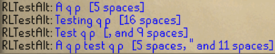

# A q p Finder 
Finds each "q p" in chat messages and displays spaces and other characters needed to be typed to match "w" in chat box.
Will automatically adjust for chat icons like ironman symbols.
Works in public and private message chats.

 Several "q p"s with inline recommendations

# Configuration
 - Show recommended characters (default) or number of pixels to match W to q p in previous line.
 - Show count between q p's (default) or count to each q p from start of message.
 - Notify when a q p is found (off by default).
 - Set chat icon (ironman, pmod, etc.) status (default none).
 - Show recommendations inline with message containing "q p" (on by default).
 - Show overlay box with dynamically updated recommendations (off by default).

---
   
    Demo of dynamic overlay recommendations for message with multiple "q p"s
